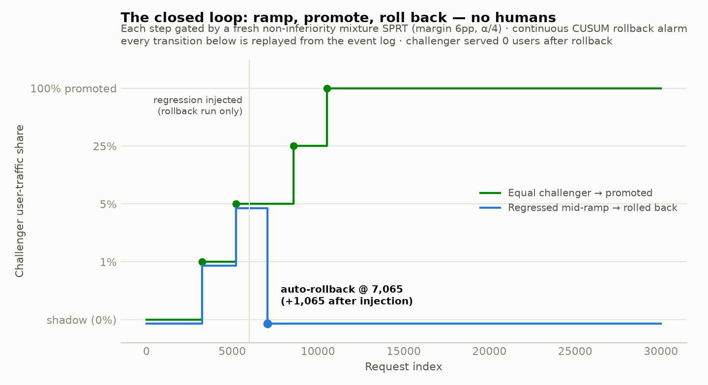
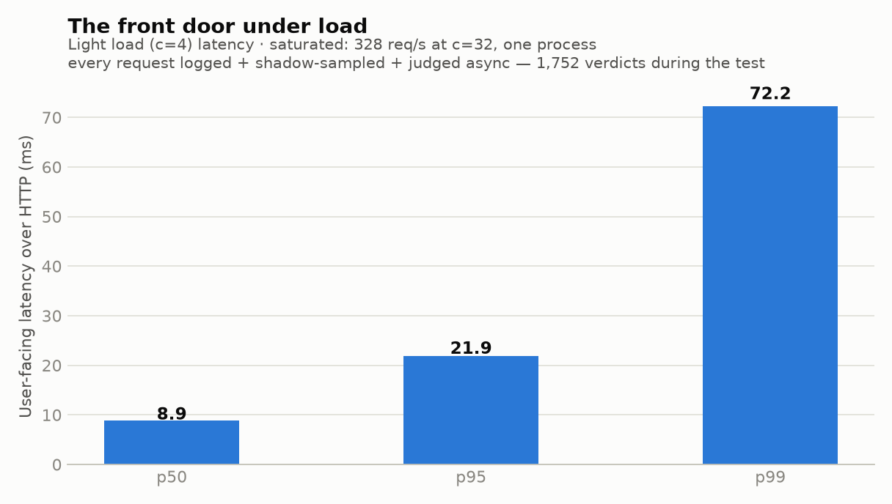
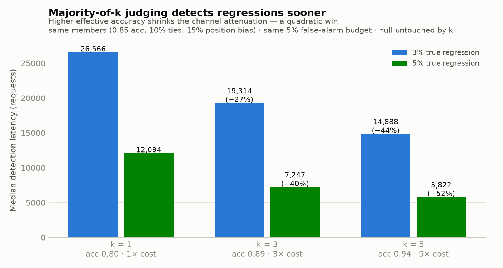
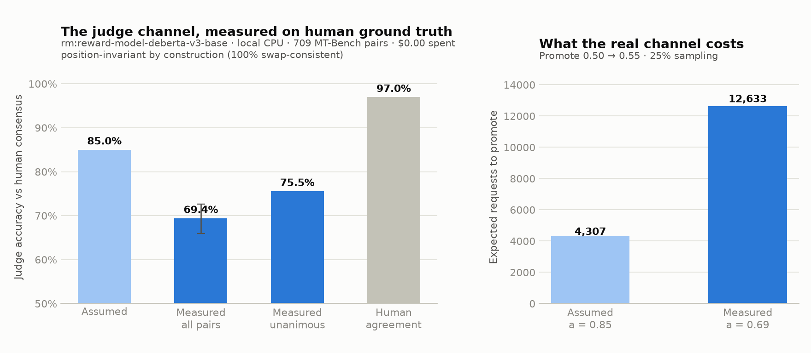

# coalmine

**An automated canary control plane for LLM configs** — shadow-tests challenger
configurations against live traffic and promotes or rolls back via sequential
hypothesis testing, with every decision statistically calibrated and auditable.

The problem: teams ship a new prompt, model version, or sampling config, then
watch a dashboard and eyeball whether quality moved. Checking results
continuously and acting when they "look significant" is statistically broken —
repeated testing inflates false alarms far past the nominal rate. coalmine
replaces the eyeball with sequential tests that hold their error budgets under
continuous monitoring, and closes the loop: shadow → gated canary ramp →
promote or auto-rollback.

## Headline results

| Claim | Measured |
|---|---|
| Repeated t-test "peeking" vs calibrated sequential monitoring, same nominal 5% | **43.7% vs 5.9%** false alarms |
| Closed canary loop: mid-ramp regression auto-rolled-back, zero humans | **+1,065 requests** after injection; 0 challenger-served users after |
| Chaos: every judge worker killed mid-run on the Redis fleet (~2,700 req/s) | **byte-identical** final state, same alarm |
| Judge measured against 709 human-labeled MT-Bench pairs, $0.00 spent | **69.4%** agreement; promotion cost 4.3k → 12.6k requests vs assumed channel |
| Majority-of-3/5 ensemble judging (effective accuracy 0.80 → 0.89 / 0.94) | detection latency **−27% to −52%** |
| Shadow-testing overhead at 100% sampling, challenger 50% slower | **+0.2ms** p99 user-facing |
| Verification | 135 deterministic tests (CI: real Postgres + Redis), 17 reproducible experiments |

Every threshold in the system is calibrated by simulating its own procedure;
every claim above regenerates from a seeded experiment listed under
[Repro](#repro).

## The decision engine

All numbers from seeded runs — reproduce with the commands under Repro.

**Peeking is broken; the sequential test is not.** On identical null streams
(no regression, 20,000 pairwise verdicts), a repeated t-test peeking every 100
verdicts false-alarms **43.7%** of the time despite claiming 5% per check. A
CUSUM with its threshold calibrated to a 5% budget over the same horizon
realizes **5.9%**.


**Detection latency vs regression size, at that controlled false-alarm rate.**
Regressions are injected at a known changepoint with exact ground-truth size;
verdicts arrive through a judge modeled as a noisy channel (accuracy 0.85, tie
rate 0.10), so a true 3-point win-rate drop reaches the detector as a 2.1-point
observed drop. Median detection: a 5-point true regression in ~2,000 verdicts,
a 3-point one in ~4,800 (caught 84% of runs within a 15,000-verdict budget).


**The implementation matches Wald's theory.** Empirical promote-probability and
expected-sample-size curves sit on the closed-form predictions across the whole
operating range, with the small upward gap in E[N] that boundary overshoot
predicts. This is the evidence the engine is correct, not just plausible.


## Traffic, shadowing, and the event log

**Shadowing costs the user nothing — measured, not asserted.** Three paced runs
(1,200 requests at 60 rps) share identical seeded arrivals and champion latency
draws; only the shadow rate varies. With 100% of traffic shadowed to a
challenger 50% *slower* than the champion, p99 user-facing latency moves from
215.8ms to 216.0ms — 0.2ms, within timer noise. Shadow calls are fired as
tasks that the user path never awaits.


**Injected ground truth is recoverable from the event log.** A 20,000-request
run injects a 10% ε-mixture regression into the challenger at request 10,000.
Replaying the append-only log recovers ε = 0.000 before the changepoint and
0.099 after, against 0.10 injected — the property that makes every future
detection claim scorable against exact truth. Same-seed runs produce identical
order-free content fingerprints (response content is a pure function of
(seed, request, config); scheduler interleaving is canonicalized away).


Storage is event-sourced behind one interface with two backends — SQLite
(zero-setup dev) and Postgres (the fleet backend, exercised in CI against a
real service container). Appends are idempotent on (run_id, seq), so
at-least-once delivery yields exactly-once storage: chaos testing is safe by
construction.

## The judging layer, and the full loop

**The full loop catches an injected regression end to end.** Traffic,
judging, and detection composed: 30,000 simulated requests flow through the shadow router;
a noisy position-randomized judge (accuracy 85%, ties 10%, position bias 15%)
turns the 25% shadow-sampled pairs into verdicts; the calibrated CUSUM watches
the decisive-verdict stream. A 15% ε-mixture regression injected at request
10,000 drags the observed win rate from 49.8% to 44.0%; the alarm fires 5,566
requests later, while the paired null run stays quiet for all 30,000 requests.
Traffic, verdicts, and detection all live in one replayable event stream.


**Position bias: measured, and neutralized by randomization.** The same
equal-quality responses judged by the same judge with a 20% first-position
preference: randomized presentation preserves parity (49.8%) and exposes the
bias in position space (+9.1 points toward first-shown); always showing the
champion first silently corrupts the challenger's measured win rate to 38.9%.
Every real comparison in this system randomizes — and records the order, so
the bias stays measurable.


**The system monitors its own sensor.** Every detection guarantee is
conditioned on judge accuracy, so the judge is re-calibrated each round
against a frozen anchor set with known labels. When the judge's true accuracy
silently degrades from 0.85 to 0.72, the Wilson interval crosses the design
tolerance in the very round the degradation begins — zero false alarms in the
ten healthy rounds before it. (One post-degradation round briefly recovers
above threshold on sampling noise; alarm persistence rules are future work,
and honestly noted.)


The production judge (`coalmine.judging.llm.LLMJudge`, Claude Haiku via
structured outputs, temperature 0) implements the same protocol as the
simulation oracle and sees only query and response texts — never config
identity or ground-truth labels. Per the cost discipline in the design, the
big experiments never call it: it exists for the live demo path and the
anchor-set calibration study that estimates the channel parameters.

## Three sequential methods, k challengers, stratified monitors

**Three-way method comparison — each method's real trade-off, measured.**
Wald's SPRT, the one-sided mixture SPRT (the always-valid method Optimizely
industrialized), and the Howard-et-al stitched confidence sequence, all at a
nominal 5%. SPRT is fastest at its design point but its detection rate
collapses to 33% at effects smaller than the point alternative it was tuned
for; the mixture SPRT detects reliably at every effect size with no
alternative to tune, at ~1.6× lower latency than the stitched CS; the
stitched boundary realizes only 0.27% of its 5% budget — the closed form is
paid for in conservatism. All three hold the error budget.


**Why the alarm is a CUSUM and not an anytime test.** The always-valid
methods test a fixed hypothesis over the whole stream, so a healthy prefix
buries a late regression: their detection latency grows ~5× as the prefix
grows to 10,000 verdicts, while CUSUM — which restarts its evidence at zero —
stays flat at ~1,100 verdicts regardless. Promotion gates and regression
alarms are different primitives; this chart is the reason.


**Four challengers without alpha spending is peeking again.** Watching 4 null
challengers each at α = 5% promotes some not-better arm 15.0% of the time —
3× the budget. Splitting the budget (α/4 per arm, valid at any k by union
bound over anytime tests) holds the family-wise error at 3.9%, and the
measured price is +48% promotion latency on a truly better arm.


**Stratified monitors catch what the aggregate smears out.** A regression
confined to one topic (25% of traffic) is diluted 4:1 in the aggregate win
rate but violent inside its stratum. Per-topic CUSUMs at α/4 — reusing the
topic labels already in the event log — catch it 1.9× sooner than the
aggregate monitor (+5,819 vs +10,977 requests), with zero false alarms on
healthy topics or the paired null run. Run end to end through the real
pipeline: traffic → judge → per-stratum detection.


## The fleet: chaos, drift gating, and the judge ensemble

**The fleet on real Redis, with every worker killed — and nothing changes.**
The multi-service pipeline (traffic → router → 3 judge workers in one
consumer group → decision engine, with the drift monitor alongside) sustains
~2,700 req/s over Redis Streams. In the chaos run all three judge workers are
killed mid-flight; unacked messages are reclaimed by the survivors, and
because every effect is idempotent (event seqs derived from request identity)
and deterministic (per-request RNG streams), the run converges to
byte-identical verdicts and the identical alarm at request 13,258 — verified
by fingerprint. The fleet's detection latency independently reproduces
the in-process pipeline's result on the same statistical setup.


**The drift gate: "traffic changed, not the model."** The challenger has a
stable weakness on one topic; at request 15,000 the traffic mix shifts toward
that topic and the aggregate win rate drops — with neither config changed. An
ungated CUSUM blames the model (false quality alarm at 20,110). The drift
monitor sees the mix shift in 199 requests, fires first, resets the in-flight
test and re-baselines; per-topic win rates confirm nothing moved within any
topic (coding: 45.7% → 44.9%). A homogeneous control shows the gate isn't
suppression: its drift alarm fires, its quality alarm never does.


**The ensemble absorbs a failing judge — and notices it without labels.**
When one of three judges silently degrades (0.85 → 0.55), majority voting
holds ensemble accuracy at 86.6% while the bad member falls to coin-flip
territory — and the members' disagreement rate jumps past its calibrated
threshold 249 comparisons after the degradation begins, a sensor alarm that
needs no ground truth and fires long before the next scheduled anchor-set
calibration round.


The fleet is observable end to end: Prometheus counters and histograms per
stage (`coalmine.fleet.metrics`), and `deploy/docker-compose.yml` brings up
Redis, Postgres, Prometheus, and a provisioned Grafana dashboard for local
runs. The event log doubles as the trace — every request's path through the
pipeline is reconstructible from its events.

## The closed loop

**The capstone: ramp, promote, and roll back — no humans.** An equal-quality
challenger climbs the whole ladder through the live fleet — shadow → 1% → 5%
→ 25% → 100% — each step gated by a fresh non-inferiority mixture SPRT
(6-point margin, α/4 per gate so the whole ramp holds α), promoted at request
10,525. A challenger that regresses mid-ramp (ε = 25% injected during the 5%
stage) is caught by the continuous rollback CUSUM **1,065 requests after the
injection** and yanked to 0% — after the rollback's share update reaches the
router, the challenger serves exactly zero users. Every gate pass, the
promotion, and the rollback are events; the audit trail is read back from the
store, not from program state.



**The front door.** `python -m coalmine.api.server` starts the serving API
with the judging fleet and canary controller behind it: POST `/serve` routes
each user request per the lifecycle's current share, GET `/state` reports the
lifecycle, GET `/events/stream` tails the log as SSE, and `/` is a live
dashboard (stage, share, rolling win rate, audit trail, event tail — no build
step, no external assets). Load-tested through real HTTP: **8.9ms p50 / 72ms
p99** at light load, **~330 req/s saturated** on a single process with every
request logged, shadow-sampled, and judged asynchronously.
`deploy/k6-load.js` is the equivalent k6 scenario.



## Sharper detection, and a judge measured on humans

**Ensemble judging buys back the channel's attenuation — quadratically.**
Detection latency scales like 1/shift² and the judge channel attenuates every
true shift by (2a − 1), so raising effective judge accuracy pays off twice
over. Majority-of-k voting with the same noisy members (0.85 accuracy, 10%
ties, 15% position bias) raises measured effective accuracy 0.80 → 0.89
(k = 3) → 0.94 (k = 5), cutting median detection latency for a 3% true
regression from 26,566 requests to 19,314 (−27%) and 14,888 (−44%) — and for
a 5% regression by up to −52% — at k× judge cost, with the null (and so the
false-alarm budget) untouched by k. This is the sampling-rate knob's sibling:
two principled ways to spend judge budget for faster detection.



**The judge channel, measured on human ground truth — for $0.00.** The
"real-judge study" needs no AI API at all: the judge is a local CPU reward
model (OpenAssistant DeBERTa — position-invariant *by construction*, verified
100% swap-consistent, ~0.5s/verdict), and the ground truth is LMSYS's
MT-Bench human judgments — 709 consensus-labeled pairs of real model
responses. Measured accuracy against human preference: **69.4%**
[65.9, 72.7] overall, 75.5% on unanimously-voted pairs, against a 97% human
self-agreement ceiling. The planning consequence is the study's real
takeaway: at the measured channel, a promotion decision that the assumed
a = 0.85 channel prices at ~4,300 requests actually costs ~12,600 — judge
quality is the single most expensive parameter in the system, which is
exactly what the ensemble result above (and paid API judges, for teams that
use them) buys back.



## Honest ledger

Everything above is measured by seeded, reproducible experiments; every
detector's threshold is calibrated by simulating its own procedure. The
judge channel is now grounded in real human-preference data via the local
reward-model study (zero API cost); `LLMJudge` (Claude via structured
outputs) remains built and unit-tested for teams that want an API judge —
its live calibration would run through the same anchor machinery. Remaining
future work, deliberately not claimed: real-response pools for the traffic
simulator (the MT-Bench loader is the natural source), a React/Vite build of
the dashboard (the current one is a self-contained single file), k6 runs
with the real binary (the Python load harness is the measured path), and
Postgres partitioning for long-horizon soaks.

## Design principles

- **Verdict-channel abstraction.** The decision engine consumes win/loss/tie
  streams and does not care where they come from. Monte Carlo experiments use a
  synthetic generator; production uses an LLM judge. The judge is modeled as a
  noisy channel (accuracy, tie rate) whose parameters are measured, and tests
  are designed on the observed scale — judge error attenuates every effect by
  2·accuracy − 1, and ignoring that miscalibrates the tests.
- **Exact ground truth via ε-mixture injection.** Simulated regressions serve
  from a deliberately-bad response pool with probability ε, so the true effect
  size is exact by construction and "detected the 3% regression" is a
  measurable claim.
- **Two primitives, two jobs.** The SPRT is the promotion gate (fixed
  hypothesis, decide once); Page's CUSUM — the SPRT reflected at zero — is the
  regression alarm (a change starting at an unknown time). Same likelihood
  ratios, different machines.
- **Two-tier CI.** Every test in `tests/` is seeded and deterministic — a
  failure is a regression, never an unlucky draw. Fresh-seed statistical soaks
  run on manual dispatch.

## Repro

```bash
uv venv .venv && uv pip install -e ".[dev]" -p .venv/bin/python
.venv/bin/pytest -q                        # 129 deterministic tests (Postgres + Redis in CI)
.venv/bin/python -m coalmine.experiments.detection_latency
.venv/bin/python -m coalmine.experiments.sprt_validation
.venv/bin/python -m coalmine.experiments.epsilon_verification
.venv/bin/python -m coalmine.experiments.shadow_overhead
.venv/bin/python -m coalmine.experiments.full_loop
.venv/bin/python -m coalmine.experiments.position_bias
.venv/bin/python -m coalmine.experiments.judge_calibration
.venv/bin/python -m coalmine.experiments.method_comparison
.venv/bin/python -m coalmine.experiments.multiarm
.venv/bin/python -m coalmine.experiments.stratified
.venv/bin/python -m coalmine.experiments.fleet_run       # uses local Redis if present
.venv/bin/python -m coalmine.experiments.drift_gate
.venv/bin/python -m coalmine.experiments.judge_ensemble
.venv/bin/python -m coalmine.experiments.canary_lifecycle
.venv/bin/python -m coalmine.experiments.http_load
.venv/bin/python -m coalmine.api.server                  # live server + dashboard
```

Runs on CPU in a few minutes; no GPU anywhere. The Postgres store tests skip
unless `COALMINE_PG_DSN` is set (CI provides a postgres:16 service container).

Architecture notes and the full design rationale live in
[docs/DESIGN.md](docs/DESIGN.md); interview-ready summaries of every
number in [docs/INTERVIEW_PREP.md](docs/INTERVIEW_PREP.md). MIT licensed.
